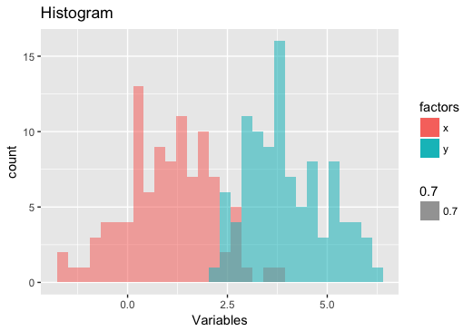

# Personal R Library

## Fancy Implementations

This library mainly contains wrapper code that calls ggplot2 & fitdistr(plus) to save time writing code & making histograms (`hist_fancy`) and QQ-plots (`qqplot_fancy`).

### hist_fancy

This is mainly for plotting multiple histograms quickly, although you can make pretty looking this way.

***Example:***

```R

hist_fancy(x = rnorm(100, 1),
           y = rnorm(100, 4),
           alpha = 0.7,
           main = "Histogram",
           xlab = "Variables")

```


### qqplot_fancy

This function plots a best fitting QQ-plot to the data using ggplot2 and using parameters from fitdistr(plus & actuar).

***Defaults:***

The `dist = ` is set to `"normal"` by default. You may specify either:
1. Another sample. `qqplot_fancy` will convert this to a same-length "Theoretical/Model" vector using `quantile(..., ppoints(...))`.
2. A string containing a distribution to fit. Can be one of beta, exponential, gamma, log-normal, lognormal, normal, pareto, t or weibull.
The color can be manually set by `col = `; this uses the same code as `hist_fancy`.

***Example:***

```R

qqplot_fancy(rnorm(100))

```


```R

qqplot_fancy(rexp(100), "exponential")

```


```R

qqplot_fancy(rexp(100), rexp(95))

```


## Simulate Engine

The code is a nightmare inducing hell that's being cleaned up.

## Other Features

### is.even / is.odd

Tells you if a vector of numbers is even or not. Example:

```R

is.even(1:5)
## [1] FALSE  TRUE FALSE  TRUE FALSE

is.even(1:10, n = TRUE)
## [1] 2  4  6  8 10

is.odd(1:5)
## [1] TRUE FALSE  TRUE FALSE  TRUE

is.odd(1:10, T)
## [1] 1 3 5 7 9

```

### ggcols

Returns a vector of strings representing color hashes based on the ggplot2 color wheel.

The code was taken from:
https://stackoverflow.com/questions/8197559/emulate-ggplot2-default-color-palette
Credits go to Colby, Hadley & zx8754.

***Example:***

```R

cols <- ggcols(100)
# Display cols on a plot to get:

```


### clplot

This plots a graph in the command line (without calling the GUI plotter). Set the width (number of bins) using `plot.size = ` (default is 10). X represents lots of mass in an area, x represents a little lower mass and . represents a little non-zero mass.

```R
clplot(iris$Sepal.Length, iris$Petal.Length)
```

```R
    4.3 4.6 4.8 5.1 5.3 5.6 5.8 6.1 6.4 6.6 6.9 7.1 7.4 7.6 7.9
6.9                                                     .   .  
6.5                                                 .       .  
6.1                                 .   .   .   .   .       .  
5.6                             .   .   .   x                  
5.2                     .   .   .   .   .   .                  
4.8                     .   .   x   .   .   .   .              
4.4         .       .   .   .   .   .   .   .                  
4               .   .   .   .   .                              
3.5         .       .   .                                      
3.1         .   .                                              
2.7                                                            
2.3                                                            
1.8         .   .                                              
1.4 .   .   X   X   x   .                                      
1   .   .   .       .       .                                  
```

### %=%

This imitates Python's comma assignment syntax (because I'm a nutcase):

```R

"a, b" %=% "1, 2"
## ...
# a
## 1
# b
## 2

```
